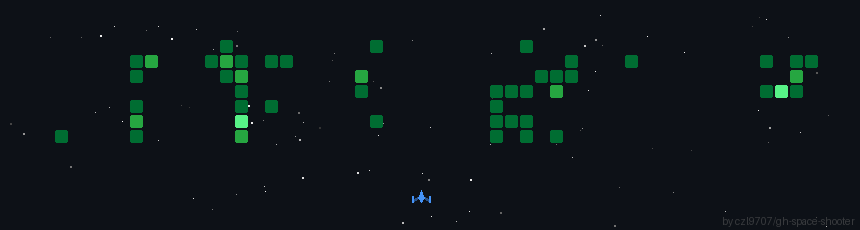

# Hi there 👋

Welcome to my GitHub profile! I'm passionate about AI, cybersecurity, development, and open-source projects. Here you'll find my latest work and contributions to the tech community.

 I leverage cutting-edge tools and technologies to build innovative solutions and explore new possibilities in the digital space.

 Portfolio : https://jaguarfbl.github.io/folio/

---

## 🛠️ Technologies & Tools

### AI & Machine Learning
* **Mistral AI** - For advanced language models and AI applications
* **Claude** - For intelligent problem-solving and content generation

### Operating Systems
* Windows 11
* Kali Linux (for cybersecurity and penetration testing)
* Ubuntu
* Linux Mint

### Development & Design
* **VS Code** - My primary code editor for all development work
* **Brave Browser** - Privacy-focused web browsing
* **Firefox** - Cross-platform development and testing

### Productivity & Entertainment
* **Spotify** - Music and audio content
* **YouTube** - Learning and entertainment

---

## 📊 GitHub Stats

### My Activity Overview

### Top Programming Languages

---

---

**Last Updated:** March 2026
